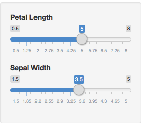
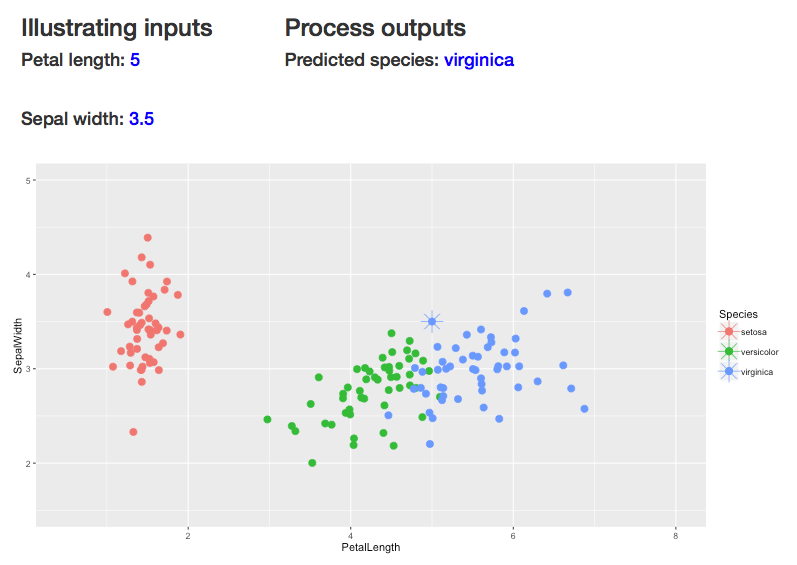

## The approach:
* The *iris dataset* contains 4 characteristics for 50 species of iris flowers. To ease graphic representation I selected two significative characteristics among the four available (Petal length and Sepal width). 
* A PCA analysis of the dataset confirms that two components capture most of the variability.
* A random forest model predicts species using Petal length and Sepal width provides a 93% of accuracy.


```r
data(iris)
inTrain <- createDataPartition(y=iris$Species, times = 1, p=0.8,list = FALSE) 
irisTrain <- iris[inTrain,]
irisTest <- iris[-inTrain,] 
irisFit <- randomForest(Species ~ Petal.Length + Sepal.Width, data = irisTrain) 
confusionMatrix(irisTest$Species, predict(irisFit, irisTest[1:4]))$overall[1]
```

---

## Input description

* The inputs expected form the user are the Petal length and Sepal width of the flower whose species we want to predict.
* These inputs have been modeled as sliders, that allow to choose values from a range that is assumed appropriate for the prediction to be effective.

<div style='text-align: center;'>
    
</div>

---

## Output description

* Confirmation of the input values
* Predicted species
* Plot representing the *Iris dataset* and the user described flower
* The output gets refreshed everytime any of the inputs change

<div style='text-align: center;'>
    
</div>

